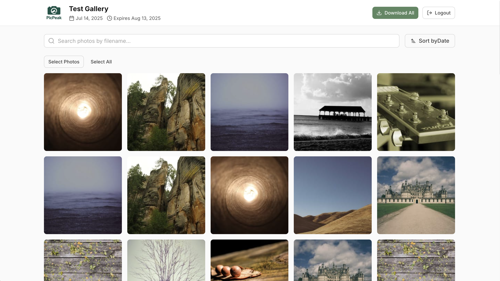
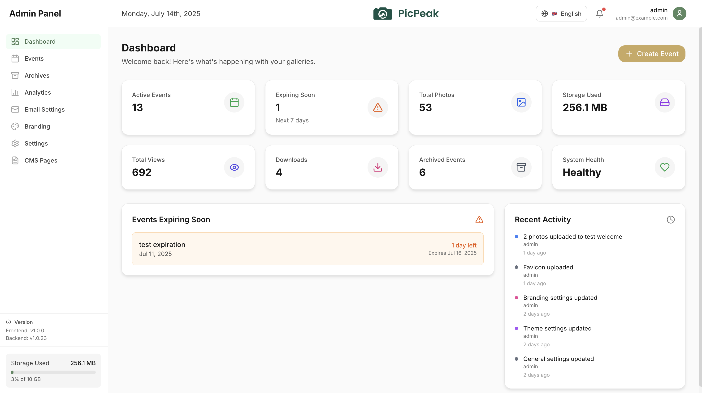
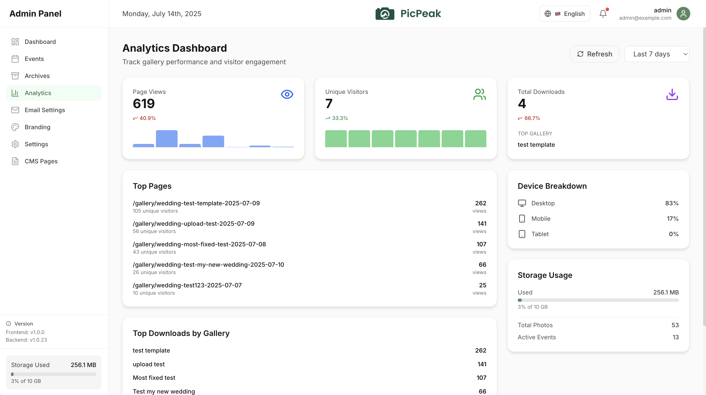
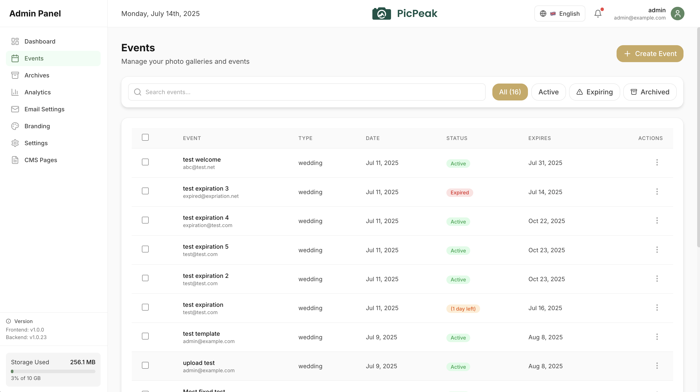

# 📸 PicPeak - Open Source Photo Sharing for Events

<div align="center">
  
  
  [](https://opensource.org/licenses/MIT)
  [](https://www.docker.com/)
  [](https://nodejs.org/)
  [](https://reactjs.org/)

  [Homepage](https://www.picpeak.app) · [Live Demo](https://demo.picpeak.app) · [Documentation](DEPLOYMENT_GUIDE.md)
</div>

**PicPeak** is a powerful, self-hosted open-source alternative to commercial photo-sharing platforms like PicDrop.com and Scrapbook.de. Designed specifically for photographers and event organizers, PicPeak makes it simple to share beautiful, time-limited photo galleries with clients while maintaining full control over your data and branding.



## 🎮 Live Demo

Try PicPeak without installing anything:

| | |
|---|---|
| **Demo URL** | [demo.picpeak.app](https://demo.picpeak.app) |
| **Admin Panel** | [demo.picpeak.app/admin](https://demo.picpeak.app/admin) |
| **Email** | `demo@picpeak.app` |
| **Password** | `Demo2026!` |

> The demo resets periodically. Uploaded content may be removed without notice.

## 🌟 Why Choose PicPeak?

Unlike expensive SaaS solutions, PicPeak gives you:

- **💰 No Monthly Fees** - One-time setup, unlimited galleries
- **🔒 Complete Data Control** - Your photos stay on your server
- **🎨 White-Label Ready** - Full branding customization
- **📱 Mobile-First Design** - Beautiful on all devices
- **🚀 Lightning Fast** - Optimized performance and caching
- **🌍 Multi-Language** - Built-in i18n support (EN, DE)

## ✨ Key Features

### For Photographers
- 📁 **Drag & Drop Upload** - Simply drop photos into folders
- 🔗 **External Media (Reference Mode)** - Browse and import from a read‑only external folder library without copying originals
- ⏰ **Auto-Expiring Galleries** - Set expiration dates (default: 30 days)
- 🔐 **Password Protection** - Secure client galleries
- 📧 **Automated Emails** - Creation confirmations and expiration warnings
- 📊 **Analytics Dashboard** - Track views, downloads, and engagement
- 🎨 **Custom Themes** - Match your brand perfectly
- 🌐 **Public Landing Page** - Publish a curated marketing page when guests visit your root URL

### For Clients
- 🖼️ **Beautiful Galleries** - Clean, modern interface
- 📱 **Mobile Optimized** - Swipe through photos on any device
- ⬇️ **Bulk Downloads** - Download all photos with one click
- 🔍 **Smart Search** - Find photos quickly
- 📤 **Guest Uploads** - Optional client photo uploads
- 🛡️ **Download Protection** - Advanced image protection with watermarking and right-click prevention

### Technical Excellence
- 🐳 **Docker Ready** - Deploy in minutes
- 🔄 **Auto-Processing** - Automatic thumbnail generation
- 🗂️ **Reference Library Support** - Point PicPeak at `EXTERNAL_MEDIA_ROOT` to reference existing originals, index quickly, and generate thumbnails on demand
- 💾 **Smart Storage** - Automatic archiving of expired galleries
- 🛡️ **Security First** - JWT auth, rate limiting, CORS protection
- 📈 **Scalable** - From small studios to large agencies

## 🚀 Quick Start

Get PicPeak running in under 5 minutes:

```bash
# Clone the repository
git clone https://github.com/the-luap/picpeak.git
cd picpeak

# Copy environment template
cp .env.example .env

# Edit configuration (required: JWT_SECRET)
nano .env

# Start with Docker Compose
docker-compose up -d

# Access at http://localhost:3005
```

Note on Docker file permissions (PUID/PGID)
- When using bind mounts (e.g., `./storage`, `./data`, `./logs`, `./events`), ensure the container user can write to these host folders. The backend runs as a non‑root user by default.
- Set `PUID` and `PGID` in your `.env` to match your host user’s UID/GID (run `id -u` and `id -g` on the host). Compose maps the container user to these values.
- Example in `.env`:
  - `PUID=1000`
  - `PGID=1000`
- Without this, creating events, uploads, thumbnails, or logs can fail with "Permission denied".

## 🔄 Release Channels

PicPeak offers two release channels for different needs:

### Stable Channel (Recommended)
- Production-ready releases
- Thoroughly tested before release
- Docker tags: `stable`, `latest`, or specific version like `v2.3.0`

### Beta Channel
- Early access to new features
- May contain bugs or incomplete functionality
- Docker tags: `beta` or specific version like `v2.3.0-beta.1`

### Switching Channels

Set the `PICPEAK_CHANNEL` environment variable in your `.env` file:

```bash
# For stable releases (default)
PICPEAK_CHANNEL=stable

# For beta releases
PICPEAK_CHANNEL=beta

# For a specific version
PICPEAK_CHANNEL=v2.3.0
```

Then update your containers:

```bash
docker-compose -f docker-compose.production.yml pull
docker-compose -f docker-compose.production.yml up -d
```

### Update Notifications

The admin dashboard automatically notifies you when updates are available for your channel. To disable update checks, set:

```bash
UPDATE_CHECK_ENABLED=false
```

## 📖 Documentation

- 📘 [**Deployment Guide**](DEPLOYMENT_GUIDE.md) - Detailed installation instructions
  - Includes the new [External Media Library](DEPLOYMENT_GUIDE.md#external-media-library) reference mode
- 📚 [**Admin API (OpenAPI)**](docs/picpeak-admin-api.openapi.yaml) - Machine-readable documentation for event automation endpoints
- 🛠️ [**Admin API Quickstart**](docs/admin-api-quickstart.md) - Step-by-step authentication and testing guide for the documented endpoints
- 🤝 [**Contributing**](CONTRIBUTING.md) - How to contribute
- 📜 [**License**](LICENSE) - MIT License
- 🔒 [**Security**](SECURITY.md) - Security policies
- 📋 [**Code of Conduct**](CODE_OF_CONDUCT.md) - Community guidelines

## 🌐 Public Landing Page

Spotlight your studio with a customizable marketing page at `/`:

- Head to **Admin → CMS Pages** to enable the public landing page toggle.
- Edit the provided HTML template (rich sections, hero, testimonials) and optional CSS overrides.
- The preview renders in a sandboxed iframe so you can iterate safely before publishing.
- PicPeak sanitizes stored HTML and CSS server-side—scripts, iframes, and unsafe attributes are stripped automatically.
- Use **Reset to default** anytime to restore the bundled template.
- The backend caches the rendered landing page for 60 seconds by default; override with `PUBLIC_SITE_CACHE_TTL_MS` if you need a different TTL.
- When the landing page is disabled PicPeak continues to serve the admin SPA/login exactly as before.

## 🎯 Use Cases

Perfect for:
- 💒 **Wedding Photographers** - Share ceremony photos securely
- 🎂 **Event Photography** - Birthday parties, corporate events
- 📸 **Portrait Studios** - Client galleries with download limits
- 🏢 **Corporate Events** - Internal photo sharing with branding
- 🎓 **School Photography** - Secure parent access with expiration

## 🏗️ Tech Stack

- **Backend**: Node.js, Express, SQLite/PostgreSQL
- **Frontend**: React, Tailwind CSS, Framer Motion
- **Storage**: File-based with automatic archiving
- **Email**: SMTP with customizable templates
- **Analytics**: Privacy-focused with Umami integration

## 💻 System Requirements

### Minimum Requirements
- **CPU**: 2 CPU cores
- **RAM**: 2GB minimum
- **Storage**: 20GB minimum (plus photo storage needs)
- **OS**: Linux (Ubuntu 20.04+), macOS, or Windows with WSL2
- **Node.js**: v18.0.0 or higher
- **Database**: SQLite (included) or PostgreSQL 12+

### Docker Requirements (Recommended)
- **Docker**: v20.10.0+
- **Docker Compose**: v2.0.0+

### Video Support Requirements
When enabling video uploads, consider these additional resources:

| Resource | Recommendation | Notes |
|----------|----------------|-------|
| **RAM** | 4GB+ recommended | FFmpeg processing requires more memory |
| **Storage** | Plan for 10-100x more | Videos are significantly larger than images |
| **CPU** | Additional cores help | Video thumbnail extraction is CPU-intensive |
| **Bandwidth** | Higher throughput | Video streaming requires more bandwidth |

**Technical Notes:**
- FFmpeg is bundled via npm (`@ffmpeg-installer/ffmpeg`) - no system installation required
- Maximum upload size: **10GB per video file**
- Chunked upload support for files >100MB (resumable uploads)
- Supported formats: MP4, WebM, MOV, AVI
- Video thumbnails are automatically generated from the first few seconds

**For Nginx/Reverse Proxy:**
If using Nginx, increase the client max body size:
```nginx
client_max_body_size 10G;
proxy_read_timeout 3600;
proxy_send_timeout 3600;
```

## 🤝 Contributing

We love contributions! PicPeak is built by photographers, for photographers. Whether you're fixing bugs, adding features, or improving documentation, your help is welcome.

See our [Contributing Guide](CONTRIBUTING.md) for details.

## 📊 Comparison with Alternatives

| Feature | PicPeak | PicDrop | Scrapbook.de |
|---------|---------|---------|--------------|
| Self-Hosted | ✅ | ❌ | ❌ |
| Custom Branding | ✅ Full | Limited | Limited |
| Monthly Cost | $0 | $29-199 | €19-99 |
| Storage Limit | Unlimited* | 50-500GB | 100-1000GB |
| Client Uploads | ✅ | ✅ | ✅ |
| API Access | ✅ | Paid | ❌ |
| Open Source | ✅ | ❌ | ❌ |

*Limited only by your server storage

## 🛡️ Security

PicPeak takes security seriously:
- 🔐 Password hashing with bcrypt
- 🎫 JWT-based authentication
- 🚦 Rate limiting on all endpoints
- 🛡️ CORS protection
- 📝 Activity logging
- 🔒 Secure file access

Found a security issue? Please open a [security issue](https://github.com/the-luap/picpeak/issues/new?labels=security) on GitHub

## 📸 Screenshots

### 🎛️ **Admin Dashboard**
Get a complete overview of your photo galleries, analytics, and system status.



### 📊 **Analytics & Insights**
Track gallery performance, view statistics, and monitor user engagement.



### 📁 **Event Management**
Organize and manage your photo galleries with intuitive event management tools.



### ✨ **Key Interface Highlights**

<details>
<summary>👆 Click to see more interface details</summary>

#### What makes PicPeak's interface special:

- **🎨 Clean Design**: Modern, photographer-friendly interface
- **📱 Responsive**: Perfect on desktop, tablet, and mobile
- **⚡ Fast Loading**: Optimized for quick photo browsing
- **🔒 Secure Access**: Password-protected galleries with expiration
- **📤 Easy Uploads**: Drag & drop functionality for effortless photo management
- **🎯 Client-Focused**: Intuitive gallery experience for your clients

</details>

## 🗺️ Roadmap

We're constantly improving PicPeak and welcome contributions from our community! If you have ideas for new features or want to help implement existing ones, please open an issue or submit a pull request. Your contributions help make PicPeak better for everyone.

### 🚧 Beta Features (Use at your own risk)

These features are currently in beta testing and may have limited functionality or stability:

| Feature | Description | Status |
|---------|-------------|--------|
| **Simple Deployment Script** | One-click deployment script for quick server setup with automated configuration and dependency installation | 🧪 Beta |

### 📋 Future Enhancements

| Feature | Description | Priority | Status |
|---------|-------------|----------|---------|
| **Backup & Restore** | Comprehensive backup system with S3/MinIO support, automated scheduling, and safe restore functionality | High | ✅ Implemented |
| **External Media Library (Reference Mode)** | Use an external folder library as a read‑only source with import and on‑demand thumbnail generation | High | ✅ Implemented |
| **Download Protection** | Advanced image protection system with canvas rendering, invisible watermarking, right-click prevention, and DevTools detection to protect photos from unauthorized downloads | High | ✅ Implemented |
| **Gallery Templates** | Multiple gallery layouts (grid, masonry, carousel, timeline, hero, mosaic) with custom CSS styling support. Includes starter templates like Apple Liquid Glass for complete visual customization | Medium | ✅ Implemented |
| **Face Recognition** | AI-powered face detection to help guests find their photos and create automatic person-based albums | Low | 🔄 Open |
| **Gallery Feedback** | Allow guests to like, rate, and comment on photos with admin notifications and moderation | Medium | ✅ Implemented |
| **Video Support** | Upload and display videos alongside photos in galleries with streaming support | Low | ✅ Implemented |
| **Multiple Administrators** | Support for multiple admin accounts with role-based permissions and activity tracking | Low | ✅ Implemented |
| **Filtering & Export Options** | Filter photos by likes, ratings, comments, or favorites. Search by filename. Sort by date, name, size, or rating. Export filtered selections as ZIP or generate Capture One/Lightroom-compatible file lists for professional workflows | Medium | ✅ Implemented |

**Status Legend:** ✅ Implemented | 🚧 In Progress | 🔄 Open | 📋 Planned

## 🙏 Acknowledgments

PicPeak is inspired by the best features of commercial platforms while remaining completely open source. Special thanks to all contributors who make this project possible.

### 🤖 AI-Assisted Development

This project was generated with the assistance of AI technology, but has been:
- ✅ **Fully tested end-to-end** by human developers
- 🔒 **Security audited** with comprehensive security checks
- 👨‍💻 **Human-reviewed** for code quality and best practices
- 🧪 **Production-tested** in real-world scenarios

We believe in transparent development practices and the responsible use of AI as a tool to accelerate development while maintaining high standards of quality and security.

## 📄 License

PicPeak is released under the [MIT License](LICENSE). Use it freely for personal or commercial projects.

## 🚀 Ready to Get Started?

1. ⭐ **Star this repository** to show your support
2. 📖 Read the [Deployment Guide](DEPLOYMENT_GUIDE.md)
3. 🐛 Report issues or request features
4. 🤝 Join our community and contribute!

---

<p align="center">
  Made with ❤️ by photographers, for photographers
  <br>
  <a href="https://www.picpeak.app">Homepage</a> •
  <a href="https://demo.picpeak.app">Live Demo</a> •
  <a href="https://github.com/the-luap/picpeak">GitHub</a> •
  <a href="DEPLOYMENT_GUIDE.md">Documentation</a> •
  <a href="https://github.com/the-luap/picpeak/issues">Support</a>
</p>
