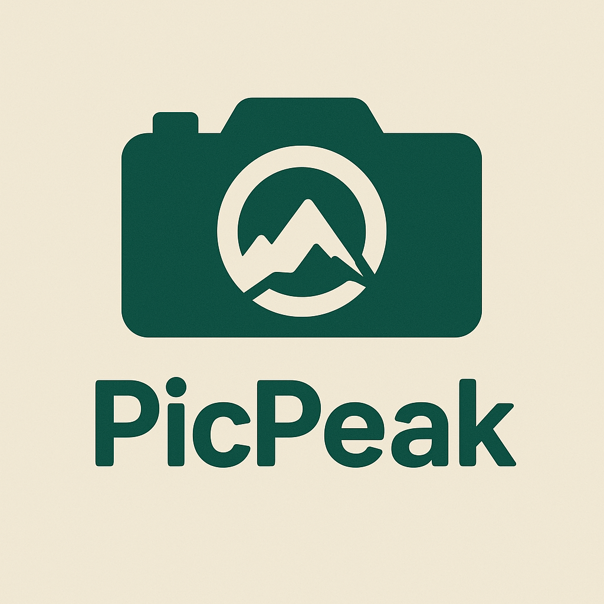
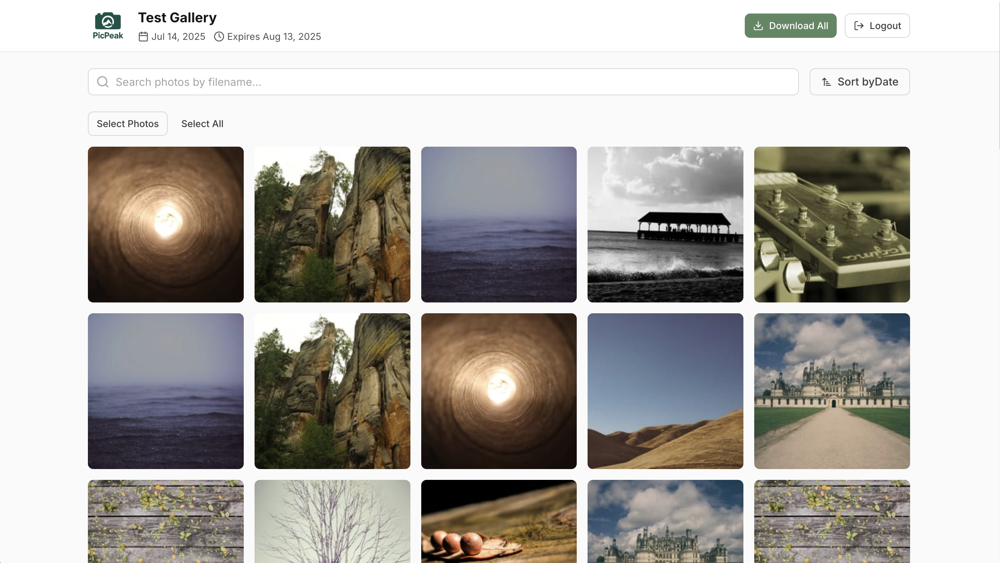
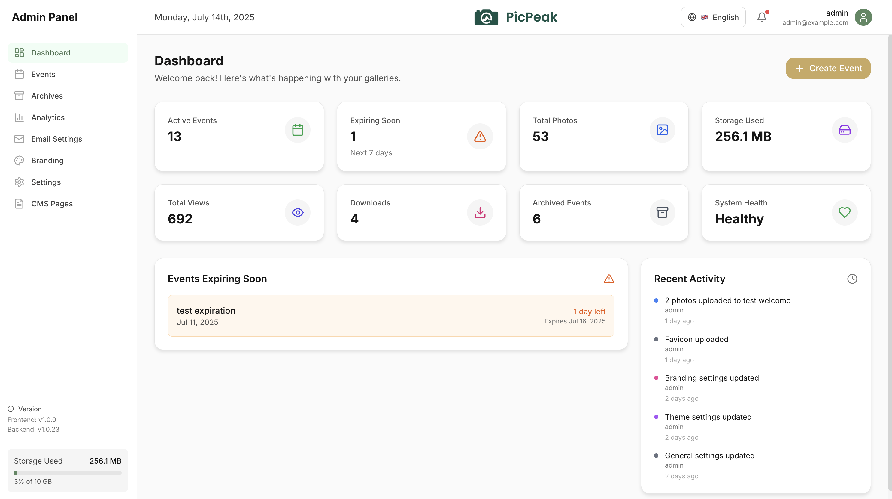
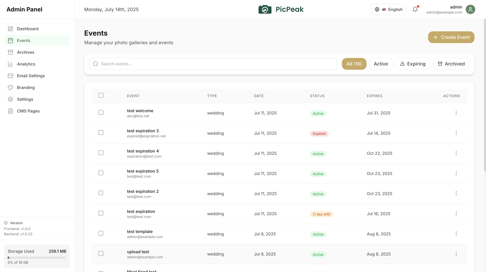
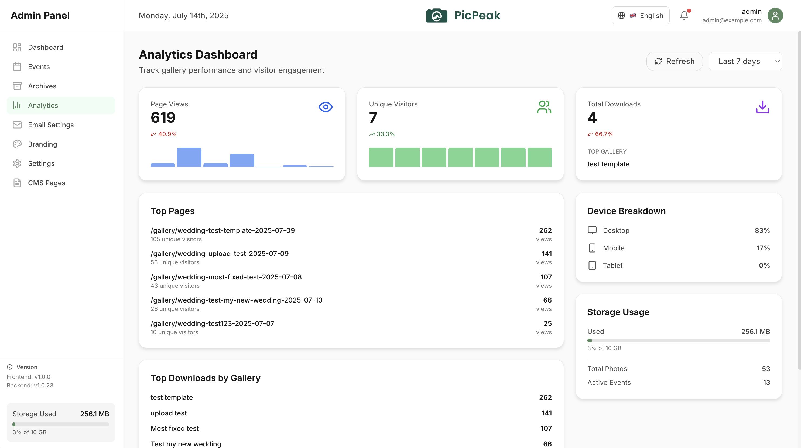

# PicPeak

<div align="center">
  

  **Self-hosted photo sharing for event photographers.**

  [](https://opensource.org/licenses/MIT)
  [](https://www.docker.com/)
  [](https://nodejs.org/)
  [](https://reactjs.org/)

  [Live Demo](https://demo.picpeak.app) · [Deployment Guide](DEPLOYMENT_GUIDE.md) · [Homepage](https://www.picpeak.app)
</div>

---

PicPeak lets you create password-protected, time-limited photo galleries for your clients — hosted on your own server. No subscriptions, no storage limits, no third-party access to your photos.



## Demo

Try it out at [demo.picpeak.app](https://demo.picpeak.app).

Admin panel: [demo.picpeak.app/admin](https://demo.picpeak.app/admin) — login with `demo@picpeak.app` / `Demo2026!`

> The demo resets periodically.

## Features

**Gallery Management** — Create galleries, upload photos via drag & drop, set passwords and expiration dates. Galleries auto-archive when they expire. Events start as drafts so you can upload and prepare before notifying the client.

**Client Experience** — Responsive galleries that look great on any device. Guests can browse, download individual photos or everything at once. Optional guest uploads and feedback (likes, comments, ratings).

**Themes & Branding** — 11 built-in theme presets, custom CSS templates, configurable colors/fonts/layouts. White-label your admin panel and login page with your own logo and company name.

**Email Notifications** — Automated gallery creation, expiration warning, and archive emails. Multilingual templates (EN, DE, NL, PT, RU) editable from the admin UI.

**Photo Protection** — Watermarking, right-click prevention, canvas rendering, DevTools detection. Configurable per gallery.

**External Media** — Reference photos from a mounted folder instead of uploading. PicPeak reads originals in place and generates thumbnails on demand.

**Multi-Language** — Full UI translations for English, German, Dutch, Portuguese, and Russian. Email templates support all languages independently.

**Analytics** — Built-in view/download tracking plus optional Umami integration for privacy-focused analytics.

**Video Support** — Upload and stream MP4, WebM, MOV alongside photos. FFmpeg bundled via npm.

**Multiple Admins** — Role-based access control with super admin, admin, and editor roles.

## Quick Start

```bash
git clone https://github.com/the-luap/picpeak.git
cd picpeak
cp .env.example .env
# Edit .env — set at least JWT_SECRET and passwords
docker compose up -d
```

Open `http://localhost:3000` and log in with the credentials from your `.env`.

> **Permissions:** Set `PUID` and `PGID` in `.env` to match your host user (`id -u` / `id -g`) so Docker volumes are writable.

See the [Deployment Guide](DEPLOYMENT_GUIDE.md) for reverse proxy setup, SSL, external media, and production configuration.

## Screenshots

<details>
<summary>Admin Dashboard</summary>


</details>

<details>
<summary>Event Management</summary>


</details>

<details>
<summary>Analytics</summary>


</details>

## Comparison

| | PicPeak | PicDrop | Scrapbook.de |
|---|---|---|---|
| Self-hosted | Yes | No | No |
| Monthly cost | $0 | $29-199 | 19-99 EUR |
| Storage | Unlimited | 50-500 GB | 100-1000 GB |
| Custom branding | Full | Limited | Limited |
| Open source | Yes | No | No |
| API | Yes | Paid | No |

## Tech Stack

- **Backend:** Node.js, Express, PostgreSQL (or SQLite)
- **Frontend:** React, TypeScript, Tailwind CSS
- **Infrastructure:** Docker, Nginx, Redis
- **Processing:** Sharp (images), FFmpeg (video)

## Release Channels

**Stable** (`stable` / `latest`) — Production-ready. Use this for real deployments.

**Beta** (`beta`) — Early access to new features. May have rough edges.

```bash
# Set in .env
PICPEAK_CHANNEL=stable  # or beta

# Update
docker compose -f docker-compose.production.yml pull
docker compose -f docker-compose.production.yml up -d
```

The admin dashboard notifies you when updates are available.

## Contributing

We welcome contributions — bug fixes, features, translations, documentation. See [CONTRIBUTING.md](CONTRIBUTING.md) for setup instructions.

## Documentation

- [Deployment Guide](DEPLOYMENT_GUIDE.md) — Installation, configuration, reverse proxy, external media
- [Admin API (OpenAPI)](docs/picpeak-admin-api.openapi.yaml) — Machine-readable API spec
- [Admin API Quickstart](docs/admin-api-quickstart.md) — Authentication and testing guide
- [Security Policy](SECURITY.md)

## License

MIT — use it for personal or commercial projects.

---

<p align="center">
  <a href="https://www.picpeak.app">Homepage</a> · <a href="https://demo.picpeak.app">Live Demo</a> · <a href="DEPLOYMENT_GUIDE.md">Docs</a> · <a href="https://github.com/the-luap/picpeak/issues">Issues</a>
</p>
