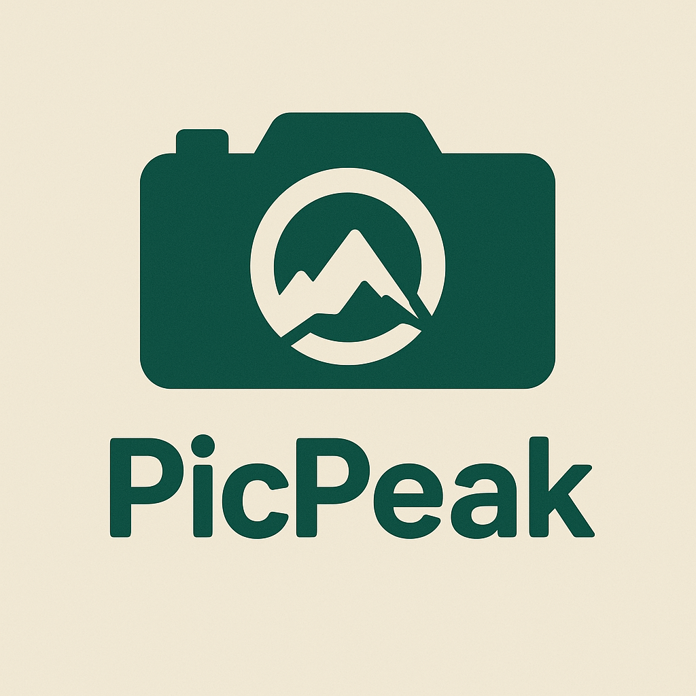
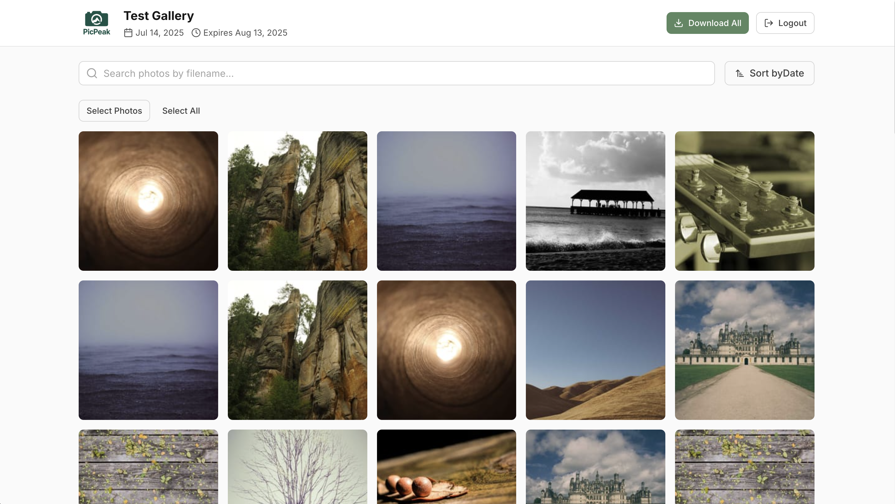
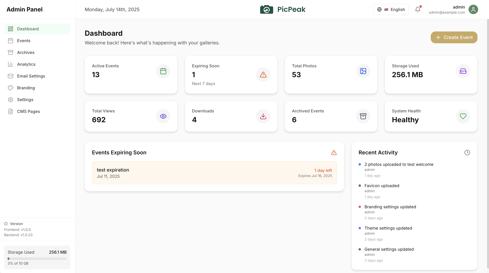
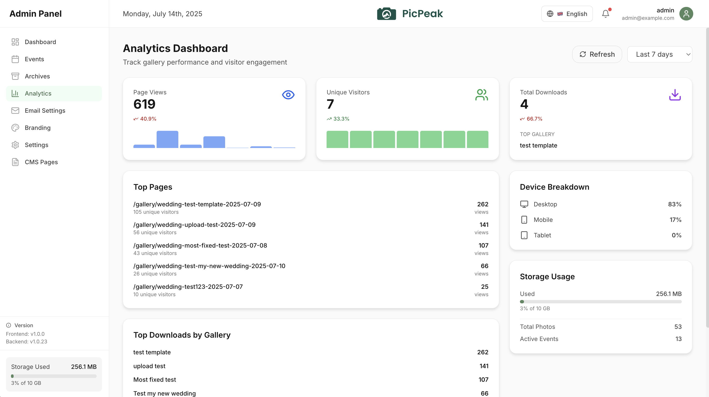
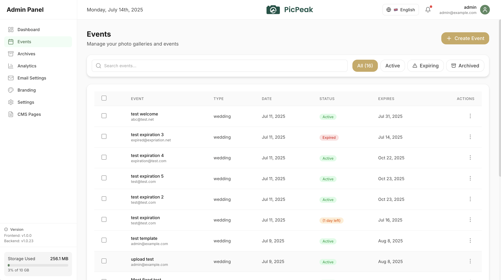

<div align="center">
  

  # 📸 PicPeak

  **Open-source, self-hosted photo sharing for events.**

  [](https://opensource.org/licenses/MIT)
  [](https://www.docker.com/)
  [](https://buymeacoffee.com/theluap)

  [Homepage](https://www.picpeak.app) · [Live Demo](https://demo.picpeak.app) · [Documentation](https://docs.picpeak.app) · [Support ☕](https://buymeacoffee.com/theluap)
</div>

---

**PicPeak** is a powerful, self-hosted open-source alternative to commercial photo-sharing platforms like PicDrop.com and Scrapbook.de. Built for photographers and event organizers, it makes it simple to share beautiful, time-limited photo galleries with clients while keeping full control over your data and branding.



> [!IMPORTANT]
> **PicPeak has moved to its own GitHub organization.** Docker images are now at `ghcr.io/picpeak/picpeak/{backend,frontend,aio,ml}` (and on Docker Hub as `picpeak/{backend,frontend,aio,ml}`) and active development is on `main`. The old `ghcr.io/the-luap/...` path still responds but its tags are **frozen** at 2026-05-27 — if updates never arrive, check your image path first. See **[`docs/migration-to-org.md`](docs/migration-to-org.md)** for the one-line `docker-compose.yml` edit.

## Contents

- [Live Demo](#-live-demo)
- [Quick Start](#-quick-start)
- [Why PicPeak?](#-why-picpeak)
- [Features](#-features)
- [Documentation](#-documentation)
- [Comparison](#-comparison-with-alternatives)
- [Tech Stack](#️-tech-stack)
- [Contributing & Support](#-contributing)
- [License](#-license)

## 🎮 Live Demo

Try PicPeak without installing anything — [demo.picpeak.app](https://demo.picpeak.app) · [admin panel](https://demo.picpeak.app/admin)

| Email | Password |
|---|---|
| `demo@picpeak.app` | `Demo2026!` |

> The demo resets periodically. Uploaded content may be removed without notice.

## 🚀 Quick Start

Get PicPeak running in under 5 minutes:

```bash
# Clone the repository
git clone https://github.com/PicPeak/picpeak.git
cd picpeak

# Copy the environment template — the defaults work out of the box.
# Machine secrets (JWT, DB, Redis) are auto-generated on first run, and the
# admin account is created in the browser. Edit .env only to customise
# (domain, SMTP, storage paths, …) — nothing is required.
cp .env.example .env

# Start with Docker Compose
docker compose up -d

# Access at http://localhost:3000
```

On first start, open **http://localhost:3000/admin** and follow the in-browser setup to create your admin account. Full details — the one-time setup token, Docker file permissions, and ARM64 notes — are in **[First-run setup](https://docs.picpeak.app/getting-started/first-login)**.

> **Updating / release channels:** set `PICPEAK_CHANNEL` (`stable` default, or `beta`) in `.env`, then `docker compose pull && docker compose up -d`. See [RELEASING.md](RELEASING.md) for the promotion cadence.

### Or: one container, no compose file

For a home server, a NAS, or a single small studio, the all-in-one image runs the whole app as one process with SQLite — no compose file, no separate database, no reverse proxy to wire up:

```bash
docker run -d --name picpeak -p 3000:3000 \
  -v picpeak:/data \
  ghcr.io/picpeak/picpeak/aio:main
```

No environment variables to set — the JWT secret is generated on first start and kept on the volume.

Then open **http://localhost:3000/admin** and read the setup token with `docker exec picpeak cat /data/db/SETUP_TOKEN`, or open `db/SETUP_TOKEN` on the volume with any file manager if the host has no shell.

`:main` is the active-development tag, and today it is the only one the all-in-one image has — `Dockerfile.aio` landed after the current stable release, so `:stable` and `:latest` first appear for this image once the aio build reaches the `stable` branch. Switch to `:stable` then, or pin a published version tag if you would rather not track `main`.

The compose stack above is still the right choice for anything busier — SQLite takes one writer at a time, and Postgres is what scales. You can move to it later without reinstalling: take a `.picpeak` backup and restore it into the full stack. See **[Single-container install](https://docs.picpeak.app/deployment/single-container)** for the volume layout, the external-Postgres variant, TLS, and the limits.

### Docker images

| | GHCR | Docker Hub |
|---|---|---|
| Backend | `ghcr.io/picpeak/picpeak/backend` | [`picpeak/backend`](https://hub.docker.com/r/picpeak/backend) |
| Frontend | `ghcr.io/picpeak/picpeak/frontend` | [`picpeak/frontend`](https://hub.docker.com/r/picpeak/frontend) |
| All-in-one | `ghcr.io/picpeak/picpeak/aio` | [`picpeak/aio`](https://hub.docker.com/r/picpeak/aio) |
| ML sidecar (optional) | `ghcr.io/picpeak/picpeak/ml` | [`picpeak/ml`](https://hub.docker.com/r/picpeak/ml) |

Both registries get the same digests and the same tags — `stable`/`latest`, a pinned `x.y.z`, and `beta`/`main` for the active development channel — for `linux/amd64` and `linux/arm64`. Keep every image in one install on the **same** tag.

## 🌟 Why PicPeak?

Unlike expensive SaaS solutions, PicPeak gives you:

- **💰 No Monthly Fees** — one-time setup, unlimited galleries
- **🔒 Complete Data Control** — your photos stay on your server
- **🎨 White-Label Ready** — full branding customization
- **📱 Mobile-First Design** — beautiful on all devices
- **🌍 Multi-Language** — built-in i18n (EN, DE)

## ✨ Features

**For photographers** — drag & drop upload, auto-expiring & password-protected galleries, automated emails, an analytics dashboard, custom themes, a public landing page, and a [Live Slideshow](https://docs.picpeak.app/features/live-slideshow) projector view that auto-picks-up new uploads during live events.

**For clients** — clean mobile-optimized galleries, one-click bulk downloads, smart search, **[People in this gallery](https://docs.picpeak.app/features/face-recognition)** face grouping (opt-in per gallery, needs the optional [ML sidecar](https://github.com/PicPeak/picpeak/blob/main/ml/README.md)), optional guest uploads, and download protection (watermarking + right-click prevention).

**Technical** — Docker-ready, automatic thumbnail generation, external media reference mode, smart archiving of expired galleries, S3-compatible [storage backends](https://docs.picpeak.app/features/storage-backends), [webhooks](https://docs.picpeak.app/features/webhooks), and security-first defaults (JWT, rate limiting, CORS).

<details>
<summary><strong>🧾 For studios — CRM &amp; Accounting (Beta, off by default)</strong></summary>

- 📝 **Quotes → Contracts → Invoices** — one deal lineage; cancel-and-reissue (Storno) keeps issued invoices immutable
- ⏱️ **Hours Logging & Calendar** — per-customer time tracking; admin calendar of events, logged hours, and pending quotes/contracts
- 🧾 **Inbound Supplier Invoices & Expenses** — capture received invoices (upload/camera, rasterised server-side), categorise, and re-bill costs to clients
- 📊 **Tax Report & Accountant Export** — period-scoped income/cost report with VAT breakdown; PDF/CSV plus a Treuhänder/Banana (Swiss/LI) journal export
- 🌍 **VAT & Multi-currency** — single VAT-code registry snapshotted onto each document

</details>

> [!WARNING]
> **CRM & Accounting — examples only, verify locally.** Feature-flagged off by default. Seeded contract blocks are written by the maintainer, **not a lawyer**; QR-bills/SEPA payloads and every tax, VAT and Treuhänder/Banana figure are computed from your input and defaults and are **jurisdiction-specific guidance only**. Have your lawyer review contracts, scan a test QR with your bank's app, and verify all numbers with your accountant / Treuhänder / tax authority before customer-facing use. Read **[the CRM disclaimers](https://docs.picpeak.app/features/crm/disclaimers)** first.

## 📖 Documentation

Full documentation lives at **[docs.picpeak.app](https://docs.picpeak.app)** — deployment, admin settings, API, branding, and more.

| Topic | Link |
|---|---|
| 🚀 Deployment (Docker, env, reverse proxy, SSL) | [docs.picpeak.app/deployment](https://docs.picpeak.app/deployment) |
| 📦 Single-container install (one `docker run`, SQLite) | [docs.picpeak.app/deployment/single-container](https://docs.picpeak.app/deployment/single-container) |
| ⚙️ Admin settings reference | [docs.picpeak.app/guides/admin-settings](https://docs.picpeak.app/guides/admin-settings) |
| 🎯 Creating events | [docs.picpeak.app/guides/creating-events](https://docs.picpeak.app/guides/creating-events) |
| 📽️ Live Slideshow | [docs.picpeak.app/features/live-slideshow](https://docs.picpeak.app/features/live-slideshow) |
| 🙂 People in galleries (face grouping) | [docs.picpeak.app/features/face-recognition](https://docs.picpeak.app/features/face-recognition) |
| 💾 Backup & Restore | [docs.picpeak.app/guides/backup-restore](https://docs.picpeak.app/guides/backup-restore) |
| 🔌 API reference | [docs.picpeak.app/api](https://docs.picpeak.app/api) |
| 🪝 Webhooks | [docs.picpeak.app/features/webhooks](https://docs.picpeak.app/features/webhooks) |
| 💾 Storage backends (local / S3) | [docs.picpeak.app/features/storage-backends](https://docs.picpeak.app/features/storage-backends) |
| 💻 System requirements & tuning | [docs.picpeak.app/deployment/system-requirements](https://docs.picpeak.app/deployment/system-requirements) |
| 🧾 CRM & Accounting | [docs.picpeak.app/features/crm](https://docs.picpeak.app/features/crm) · [disclaimers](https://docs.picpeak.app/features/crm/disclaimers) |
| 🗺️ Roadmap | [GitHub Issues](https://github.com/PicPeak/picpeak/issues) |

**Project meta:** [Support](SUPPORT.md) · [Contributing](CONTRIBUTING.md) · [License](LICENSE) · [Security](SECURITY.md) · [Code of Conduct](CODE_OF_CONDUCT.md)

## 📊 Comparison with Alternatives

| Feature | PicPeak | PicDrop | Scrapbook.de | Pixieset |
|---------|---------|---------|--------------|----------|
| Self-Hosted | ✅ | ❌ | ❌ | ❌ |
| Custom Branding | ✅ Full | Limited | Limited | ✅ (paid) |
| Monthly Cost | $0* | $29-199 | €19-99 | ~$60 |
| Storage Limit | Unlimited** | 50-500GB | 100-1000GB | 3GB–Unlimited*** |
| Client Uploads | ✅ | ✅ | ✅ | Limited |
| API Access | ✅ | Paid | ❌ | ❌ |
| Open Source | ✅ | ❌ | ❌ | ❌ |
| Customer Accounts | ✅ | ❌ | ❌ | ✅ |
| Quotes / Contracts / Invoices | 🧪 Beta | ❌ | ❌ | ✅ |
| Incoming Invoices & Accounting | 🧪 Beta | ❌ | ❌ | ❌ |

<sub>*You bring your own server and, optionally, a domain. **Limited only by your server storage. ***Pixieset's "unlimited" is photos only; video is capped by plan. 🧪 Beta = built but feature-flagged off by default.</sub>

## 🏗️ Tech Stack

- **Backend**: Node.js, Express, SQLite/PostgreSQL
- **Frontend**: React, Tailwind CSS, Framer Motion
- **Storage**: Local filesystem (default) or S3-compatible object store (AWS S3, MinIO, R2, B2, Wasabi, Spaces) — see [Storage Backends](https://docs.picpeak.app/features/storage-backends)
- **Email**: SMTP with customizable templates
- **Analytics**: Privacy-focused with Umami integration
- **External media**: point PicPeak at `EXTERNAL_MEDIA_ROOT` to reference existing originals read-only, index quickly, and generate thumbnails on demand

## 📸 Screenshots

<details>
<summary>Click to see the admin dashboard, analytics, and event management</summary>

### 🎛️ Admin Dashboard


### 📊 Analytics & Insights


### 📁 Event Management


</details>

## 🤝 Contributing

We love contributions! PicPeak is built by photographers, for photographers — whether you're fixing bugs, adding features, or improving docs. See the [Contributing Guide](CONTRIBUTING.md) to get started.

Found a security issue? Please open a [security issue](https://github.com/PicPeak/picpeak/issues/new?labels=security). See [SECURITY.md](SECURITY.md) for the policy.

## ☕ Support the Project

PicPeak is free, open source, and self-hostable forever. If it saves you time or replaces a paid subscription, consider [buying me a coffee](https://buymeacoffee.com/theluap) — it directly funds new features, bug fixes, and keeping the demo + docs running. You can also ⭐ star the repo, share it, file good bug reports, or open a PR.

## 🙏 Acknowledgments

PicPeak is inspired by the best features of commercial platforms while remaining completely open source. It's developed with AI assistance, but human-tested end-to-end, security-audited, and human-reviewed for quality.

### 👥 Contributors

A huge thank you to the people whose code, reports, and feedback have shaped PicPeak:

**[@the-luap](https://github.com/the-luap)** — creator and lead maintainer
- Gallery foundation (events, uploads, sharing, download protection, templates)
- Backup & restore, analytics, branding/theming
- The architecture every later feature builds on

**[@Luca-Timo](https://github.com/Luca-Timo)**
- Native Apple Silicon multi-arch images
- CRM & accounting suite (quotes/contracts/invoices)
- Hours logging & Treuhänder/Banana tax export
- Gallery header/banner decoupling

**[@Rekoo-PS](https://github.com/Rekoo-PS)** — bug reports & product feedback
- Login-loop fix, mobile-lightbox overhaul, bulk-delete workflow
- Also a [BuyMeACoffee](https://buymeacoffee.com/theluap) supporter

If you've contributed and aren't listed here, please open a PR — this list is meant to grow.

## 📄 License

PicPeak is released under the [MIT License](LICENSE). Use it freely for personal or commercial projects.

---

<p align="center">
  Made with ❤️ by photographers, for photographers
  <br>
  <a href="https://www.picpeak.app">Homepage</a> ·
  <a href="https://demo.picpeak.app">Live Demo</a> ·
  <a href="https://docs.picpeak.app">Documentation</a> ·
  <a href="https://github.com/PicPeak/picpeak/issues">Support</a>
</p>
